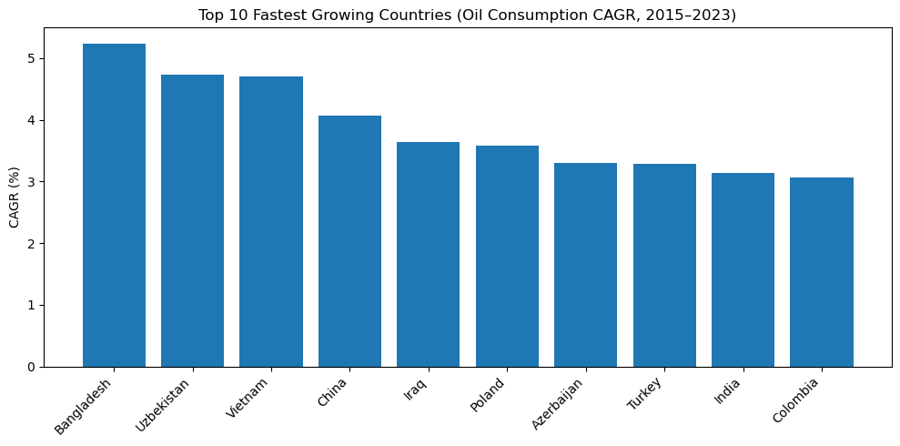
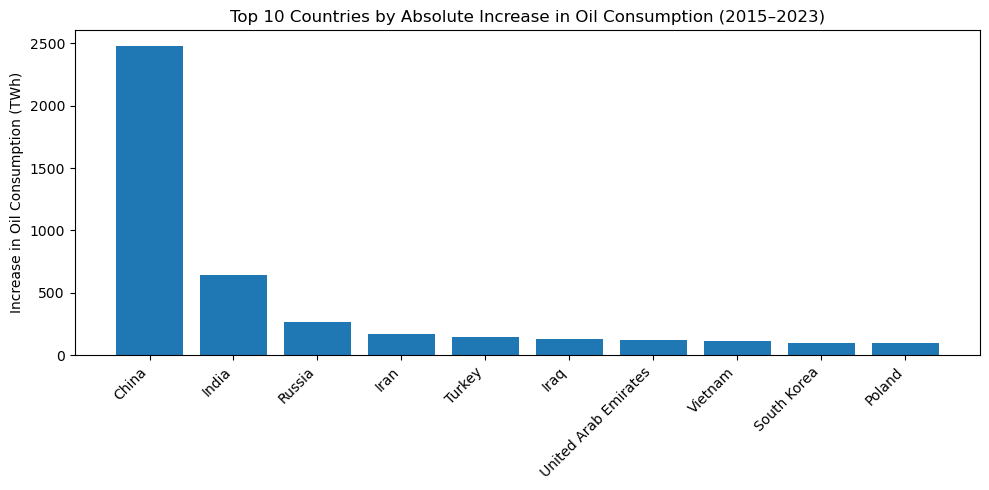
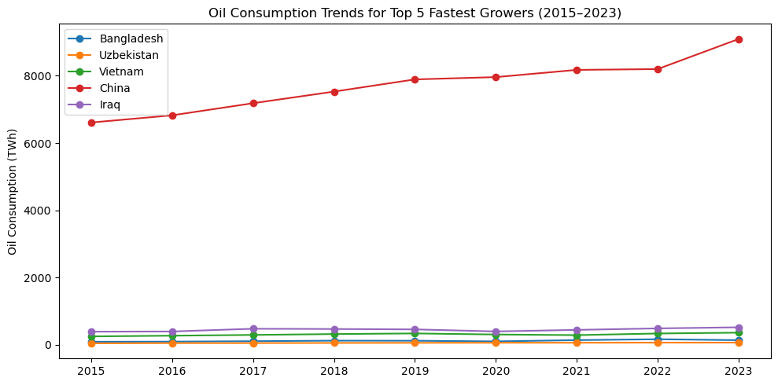
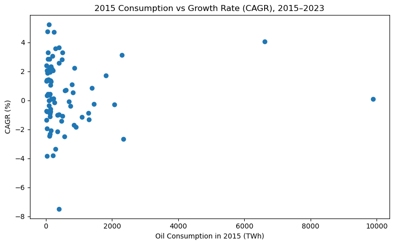

# Which Countries Have the Fastest Growth in Oil Consumption (2015–2024)?

## 📌 Business Problem

Global oil demand continues to evolve due to industrialization, urbanization, population growth, and economic expansion. While some countries dominate oil consumption in absolute terms, others may be experiencing faster growth rates.

**This analysis answers the question:**

**Which countries recorded the fastest growth in oil consumption between 2015 and 2024?**

**I examined both:**

- 📈 Growth speed (CAGR – Compound Annual Growth Rate)
- 📊 Growth size (Absolute increase in TWh)

## 📂 Data Source

**Oil consumption data (TWh) was obtained from:**

- **Our World in Data (OWID) Energy Dataset**

**Time period analyzed:**
- 2015–2024

**Data structure:**
- Country
- Year
- Oil consumption (TWh)

## Tools Used
- Python (Pandas, NumPy)
- Matplotlib / Seaborn
- Jupyter Notebook

## 🧹 Data Cleaning & Preparation (Python)

#### The following steps were performed:

- Removed aggregate regions (World, Africa, Europe, etc.)
- Kept only valid 3-letter country ISO codes
- Filtered years to 2015–2024
- Reshaped data from long to wide format
- Calculated growth metrics:
  - Absolute change (TWh)
  - Percentage change (%)
  - CAGR (%)

[View Full Analysis Here](Full_Analysis1/Full_Analysis1.ipynb)


##### Growth Formula Used

```wide["abs_change_twh"] = wide[2024] - wide[2015]```
```wide["pct_change_%"] = (wide[2024] / wide[2015] - 1) * 100```
```wide["cagr_%"] = ((wide[2024] / wide[2015]) ** (1/9) - 1) * 100```

CAGR was calculated over a 9-year period (2015–2024).

## 📊 Analysis & Visualizations

## 1️⃣ Fastest Growing Countries (CAGR %)



This visualization ranks countries by Compound Annual Growth Rate (CAGR).

**📌 What this measures:**

Growth speed relative to starting consumption levels.


**Key insights:**

- **Bangladesh, Uzbekistan, and Vietnam** show the highest growth rates, pointing to rapid increases in transport fuel use and industrial activity.

- **China appears in the top 10** despite already being a large consumer, indicating that it is growing both in size and speed.

- **Several countries in the list are emerging or middle-income economies, suggesting that future oil demand growth is shifting toward developing markets.**

⚠️ However, fast growth does not necessarily mean large total consumption.


## 2️⃣ Countries with the Largest Absolute Increase (TWh)



This visualization ranks countries by total increase in oil consumption volume.

**📌 What this measures:**

Total additional oil demand added to the global system.

#### Key Insight
**Key insights:**

- **China and India** account for the **largest absolute increases**, making them the primary drivers of global oil demand growth over this period.

- **Even though some countries grow fast in percentage terms**, this chart shows that large economies dominate total demand growth due to their scale.

- **Russia and Iran** also show notable increases, reflecting continued dependence on oil for transport and industry.

- Countries like **Vietnam and Poland** appear here despite smaller economies, indicating structural growth in energy demand in emerging and transitioning markets.

## 3️⃣ Oil Consumption Trend (Top 5 Fastest Growers)



A time-series visualization shows year-by-year changes for the top-growing countries.


**Key insights:**

- **All five countries** show a clear upward trend in oil consumption over time, confirming that their high CAGR is driven by sustained growth rather than one-off spikes.

- **Most countries display a dip or slowdown around 2020**, reflecting the impact of COVID-19 on transport and industrial activity, followed by recovery afterward.

- **China dominates in absolute scale**, but Bangladesh, Uzbekistan, and Vietnam show strong relative growth, indicating rapid industrialization and transport demand.

- **Iraq’s growth** appears more volatile, suggesting that oil consumption may be influenced by economic instability or energy policy changes.


## 4️⃣ 2015 Consumption vs Growth Rate (CAGR), 2015–2023



**Key insights:**

- Countries with low oil consumption in 2015 tend to show higher growth rates, indicating a small base effect. Emerging economies can grow fast even with modest absolute demand.

- Large consumers (far right of the chart) generally show moderate growth, meaning global demand growth is driven by both: scale (large countries like China, India), and speed (smaller fast-growing countries like Bangladesh or Uzbekistan).

- A few countries show negative CAGR, meaning their oil consumption declined between 2015 and 2023, likely due to efficiency gains, fuel switching, or economic slowdown.

This chart highlights that fast growth does not always mean large volume impact - some fast growers still contribute relatively small absolute demand.


### Overall Findings
- Fastest-growing countries are mostly emerging economies.
- Largest contributors to global demand remain large economies.
- Growth speed and growth size tell different stories.
- Oil demand growth remains resilient despite pandemic disruptions.
- Structural demand expansion is evident in developing regions.

### ⚠️ Limitations

The analysis focuses solely on oil consumption (TWh), not total energy mix.

No adjustment was made for:
- Population growth
- GDP growth
- Energy efficiency improvements

- CAGR assumes smooth growth, which may hide year-to-year volatility.

- 2024 data may be provisional or partially reported.

- This analysis does not account for policy shifts toward renewable energy.


## Conclusion
Between 2015 and 2024, oil consumption growth patterns reveal a dual dynamic:

- Smaller emerging economies are growing fastest in percentage terms.

- Large economies continue to drive the majority of absolute demand growth.

Understanding both dimensions — growth speed and growth size — is critical for:

- Energy market forecasting
- Investment strategy
- Infrastructure planning
- Climate and transition risk assessment

Oil demand remains structurally embedded in developing economies, even as global energy transition efforts accelerate.

